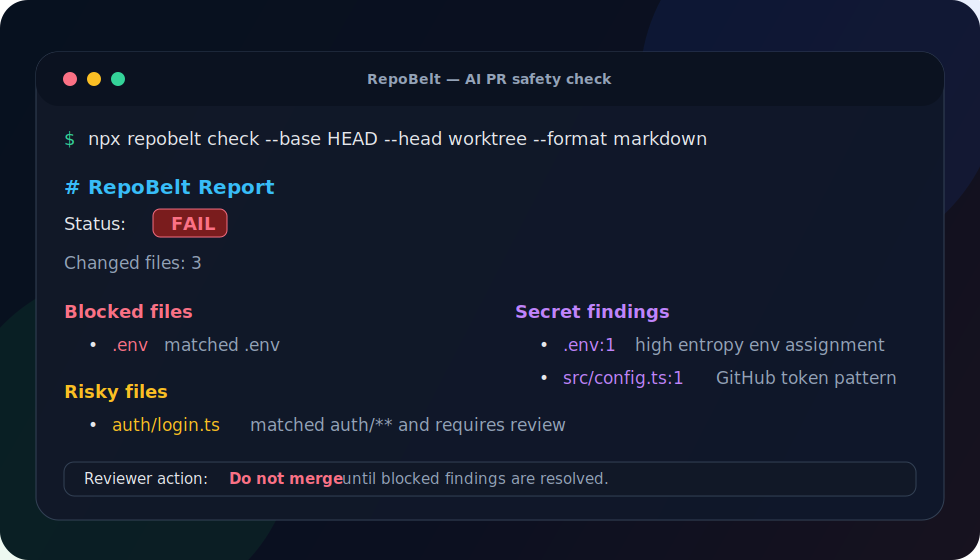

# RepoBelt

**A seatbelt for AI-generated pull requests.**

[](https://github.com/realvaleh/repobelt/actions/workflows/ci.yml)


RepoBelt is a local-first CLI and GitHub Action that checks pull request diffs for unsafe AI-agent changes before maintainers merge them.

AI coding agents can move fast. RepoBelt keeps them in bounds.



```bash
npx repobelt init
npx repobelt check --base HEAD --head worktree
```

Works with agent-heavy workflows from Claude Code, Codex, Cursor, Copilot, OpenCode, and other tools that can produce fast-moving pull requests.

See the full demo in [`docs/demo.md`](docs/demo.md).

## Why RepoBelt exists

Claude Code, Codex, Cursor, Copilot, OpenCode, and other coding agents are increasingly good at generating useful changes. But maintainers still need a deterministic safety layer around the repo:

- Did the PR touch protected files?
- Did it modify auth, payments, migrations, infra, or CI?
- Did it accidentally add a token or private key?
- Does the reviewer have a clear action summary?

RepoBelt answers those questions without trying to replace code review.

It is a **seatbelt**, not an autopilot.

## What RepoBelt checks today

- Protected paths like `.env`, `secrets/**`, `**/*.pem`, and `**/*.key`
- Risky paths like `auth/**`, `payments/**`, `migrations/**`, `infra/prod/**`, and `.github/workflows/**`
- Suspicious secrets:
  - private key blocks
  - GitHub tokens
  - OpenAI-style tokens
  - Anthropic-style tokens
  - AWS access key IDs
  - high-entropy `.env` assignments
- Markdown and JSON reports for CI and bots

## Quickstart

Run without installing globally:

```bash
npx repobelt init
npx repobelt check --base HEAD --head worktree
```

This creates:

```text
.repobelt.yml
.github/workflows/repobelt.yml
```

Or add it to a project as a dev dependency:

```bash
pnpm add -D repobelt
pnpm exec repobelt init
```

Generate a Markdown report:

```bash
npx repobelt check --base HEAD --head worktree --format markdown
```

Generate machine-readable JSON:

```bash
npx repobelt check --base HEAD --head worktree --format json
```

## Example policy

```yaml
version: 1

protected_paths:
  - .env
  - .env.*
  - secrets/**
  - '**/*.pem'
  - '**/*.key'

risky_paths:
  auth/**: require_review
  payments/**: require_review
  migrations/**: require_review
  infra/prod/**: require_review
  .github/workflows/**: require_review

required_checks:
  - test
  - lint
  - typecheck

allowlist:
  paths: []
```

## Example failed report

```md
# RepoBelt Report

**Status:** FAIL

Changed files: 2

## Blocked files

- `.env` matched `.env`

## Secret findings

- `src/config.ts:1` `github_token` matched GitHub token

## Reviewer action

Do not merge until blocked findings are resolved.
```

## GitHub Actions

The generated workflow runs RepoBelt on pull requests and writes the Markdown report to GitHub's step summary:

```yaml
- name: Run RepoBelt
  run: |
    npx repobelt check \
      --base "origin/$GITHUB_BASE_REF" \
      --head "$GITHUB_SHA" \
      --format markdown | tee "$GITHUB_STEP_SUMMARY"
```

See [`docs/github-action.md`](docs/github-action.md).

## Examples

- [`examples/basic`](examples/basic) shows a small policy with safe and risky files.
- [`docs/example-reports.md`](docs/example-reports.md) shows PASS, WARN, FAIL, and JSON output examples.

## Policy

RepoBelt reads `.repobelt.yml` from the repository root.

See [`docs/policy-v1.md`](docs/policy-v1.md) for the full policy reference, precedence rules, and suggested presets.

## CLI

```text
Usage: repobelt <command>

Commands:
  init     Create a starter .repobelt.yml and GitHub Action workflow
  check    Check a git diff against the RepoBelt policy
```

```text
Usage: repobelt check [options]

Options:
  --base <ref>                    Base git ref. Default: HEAD
  --head <ref|worktree>           Head git ref or worktree. Default: worktree
  --format <text|markdown|json>   Output format. Default: text
  -h, --help                      Show this help message
```

## How RepoBelt is different

RepoBelt is not another repository summarizer, repo-to-prompt packer, or AGENTS.md generator.

Those tools help agents understand a codebase. RepoBelt helps maintainers decide whether an agent-generated change is safe to review or merge.

## Current status

RepoBelt is early but functional:

- CLI scaffold: done
- `init`: done
- policy loading: done
- changed-file detection: done
- protected/risky path checks: done
- secret scanning: done
- text/Markdown/JSON reports: done
- GitHub Action template: done
- CI workflow: done

## Roadmap

Near-term:

- Better policy documentation
- More CLI validation
- PR comment mode
- SARIF output
- CODEOWNERS/reviewer hints

Later:

- GitHub App
- MCP integration
- policy presets for common stacks
- richer dependency and migration risk checks

## Development

```bash
pnpm install
pnpm test
pnpm build
```

See [`CONTRIBUTING.md`](CONTRIBUTING.md) and [`CHANGELOG.md`](CHANGELOG.md).

## License

MIT
